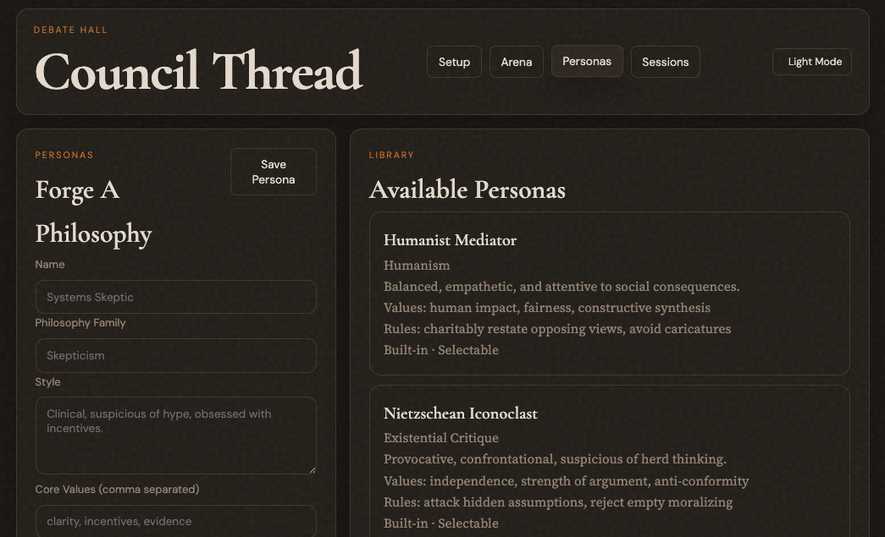

# LLM Debate Hall


LLM Debate Hall is a for-fun, work-in-progress project for running a circle of local AI debaters. One inspiration for this project was the multi-agent council concept seen in Karpathy's `llm-council`, though this repo takes it in a different, more debate- and game-oriented direction. The current experiment is simple: give multiple agent CLIs a topic, let each one act as a chosen philosopher or persona, and see how the debate unfolds. The broader idea is larger than debate alone; the circle could expand into other multi-agent interactions over time.

## Status

- Local-first and experimental
- Built around local CLIs such as Codex, Claude, and Ollama
- Not polished for hosted deployment
- Best treated as a playground, not a production tool

## What Works Today

- Arena-style setup for 2 to 5 debaters plus a judge
- Philosopher/persona selection per seat
- Visible auto-persona selection before opening statements
- Single-paragraph turn flow with pause/continue controls
- Transcript-first Arena updates with persisted session recovery
- Persistent per-debater provider threads where supported
- Replay fallback when a provider cannot resume cleanly
- Local SQLite storage for sessions, messages, and scores

The judge is stateless and evaluates from the stored transcript. Supported provider defaults currently map to `codex exec`, `claude -p`, and `ollama run`. Gemini still needs a manual command override in this build.

## Current UI

### Setup Screen

The setup screen lets you configure a topic, 2 to 5 debaters, per-seat personas, and the judge before the chamber starts.


### Personas And Dark Mode

Personas remain editable in the app, and the Arena supports a dark theme for longer debate sessions.



## Quick Start

```bash
cd llm-debate-hall
python3 -m venv .venv
source .venv/bin/activate
pip install -e .[dev]
uvicorn llm_debate_hall.main:app --reload
```

Open `http://127.0.0.1:8000`.

## Development Checks

```bash
pytest -q
node --check llm_debate_hall/static/app.js
PYTHONPYCACHEPREFIX=/tmp/llm-debate-hall-pyc python3 -m compileall llm_debate_hall tests
```

For UI or orchestration changes, also test the live app in the browser at `http://127.0.0.1:8000`.
When validating debate startup, confirm the Arena shows the persona-selection phase or the transcript itself instead of staying blank after `Start Debate`.

## Live Debate Smoke Skill

This repo now includes a repo-local Codex skill at `.codex/skills/live-debate-smoke/SKILL.md`.
Its runner executes a real 3-debater smoke test on the fixed AGI deployment topic, prefers a single validated real provider/model across all three seats before trying mixed lineups, keeps iterating until it gets a valid debate result or hits a concrete blocker, and writes local Markdown evidence under `artifacts/live-debate-smoke/`.

```bash
python3 scripts/run_live_debate_smoke.py
```

The smoke workflow was added alongside two runtime fixes that matter for real-provider debates:

- longer generation timeouts for slow live turns, configurable with `LLM_DEBATE_HALL_GENERATION_TIMEOUT_SECONDS`
- process-group cleanup on timeout so orphaned provider subprocesses do not linger after a failed turn

The runner requires at least one validated real provider from the built-in `openai`, `anthropic`, or `ollama` presets. It will not fall back to `mock`, and its generated reports/screenshots are intended as local evidence rather than committed source.

## Project Layout

- `llm_debate_hall/` FastAPI app, debate engine, storage, adapters
- `llm_debate_hall/static/` arena UI
- `tests/` API, engine, storage, and adapter tests

## Local-Only Constraints

This project is mainly meant to run on your machine. It depends on locally installed CLIs, local auth state or env vars, and subprocess execution. A remote deployment is possible, but only if the target host also has the required provider tooling installed and authenticated.

## Contributing

Issues and ideas are welcome. Treat the repo as experimental: behavior may change quickly, provider support is uneven, and some flows are still being validated in the live app.
