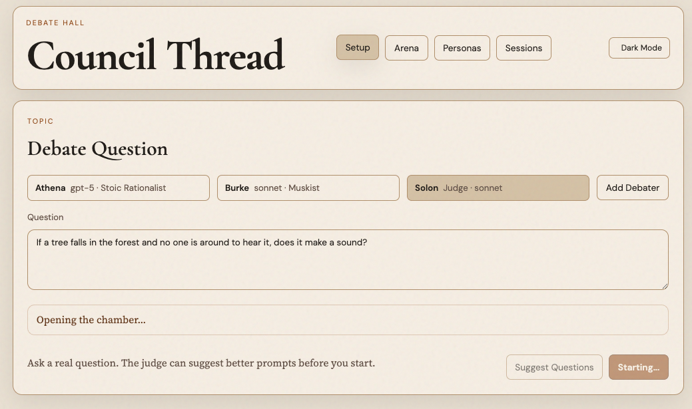
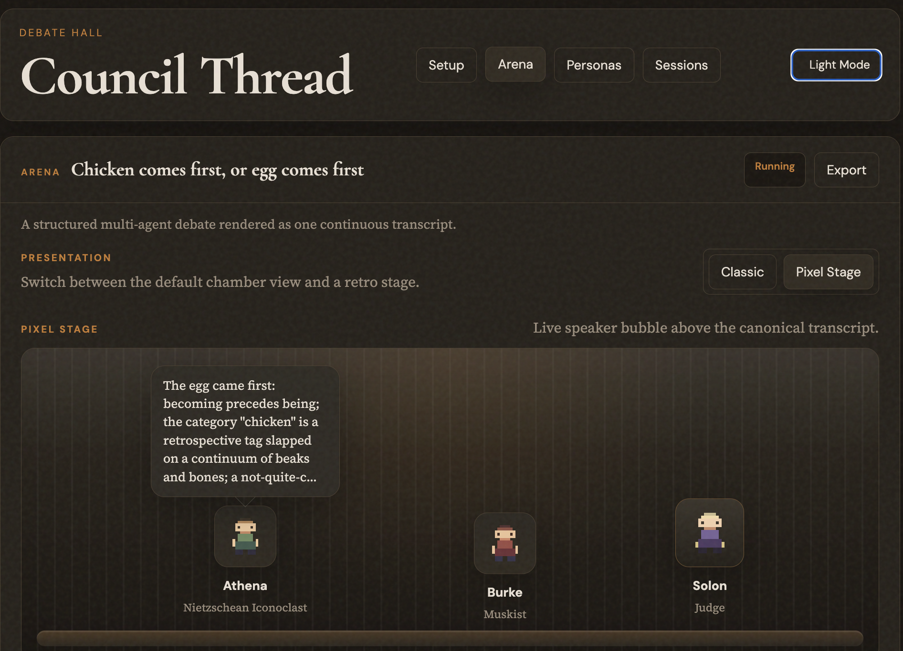
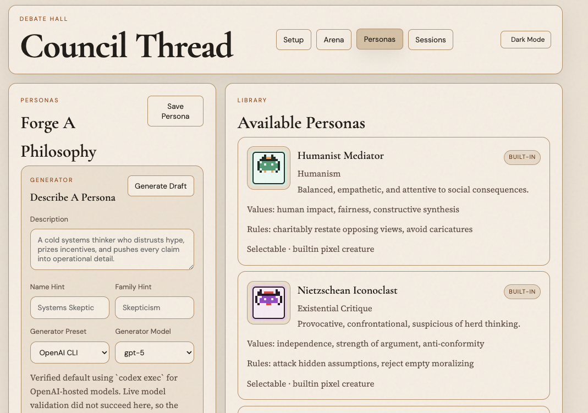

# Multi-Agent Council

Multi-Agent Council is a local-first FastAPI app for running structured multi-agent deliberations with real model CLIs, persistent transcripts, and persona-driven agents. Give several agents a question, cast each one as a distinct philosophy or style, and watch the council unfold as one continuous Chamber thread instead of a pile of disconnected model outputs.

It is built for a very specific kind of experiment: using the local tools you already trust, keeping the debate state on your machine, and making the whole exchange inspectable enough to replay, judge, and test. The result sits somewhere between an AI toy, a debate simulator, and a local developer tool for probing how different model backends reason under pressure.

## Why It Stands Out

- Local-first by default: provider CLIs, auth, storage, and transcripts stay on your machine
- Structured debates instead of raw chat panes: opening rounds, reply cycles, conversational mode, pause/continue flow, and judging
- Persona-driven seats: each debater can argue from a distinct philosophical frame or operational style
- Transcript-first design: debates are persisted, recoverable, and inspectable after the live run
- Real-provider smoke testing: the repo can now validate a full 3-debater live debate path end to end

## What It Can Do

- Single Chamber page for setup, live arena state, and transcript controls
- Per-seat model, provider, and persona configuration
- Persona intensity controls so the same persona can play subtly or aggressively without cloning it
- Persona draft generation from a freeform description, then save-as-custom in the library
- Visible auto-persona selection before opening statements, with timeout failures persisted into the run
- Debate modes for serious analysis, theatrical style, or shorter conversational back-and-forth
- Single-paragraph turn flow with pause/continue controls
- Transcript-first live updates with persisted session recovery
- Refresh control to clear the current run from the Chamber while keeping the saved session
- Persistent per-debater provider threads where supported
- Replay fallback when a provider cannot resume cleanly, including transient Claude session-lock failures
- Arena observability with per-turn latency, provider/model, fallback state, token estimates, and a timeline
- Structured trace export for later analysis
- Local SQLite storage for sessions, messages, and scores

The judge is stateless and evaluates a blinded stored transcript with a strict scorecard. Supported provider defaults currently map to `codex exec` and `claude -p`. Gemini still needs a manual command override in this build, and custom commands are disabled by default.

## Local Security Model

Multi-Agent Council launches local provider processes, so its trust boundary is deliberately narrow:

- HTTP and WebSocket requests are accepted only from loopback clients by default.
- The frontend is same-origin; the server does not grant wildcard cross-origin access.
- Built-in provider commands inherit credentials from the server shell.
- Browser-supplied command, argument, and environment overrides are rejected by default.
- Session APIs and exports redact stored environment values, including in explicitly unsafe override mode.

Set provider credentials in the shell that launches `uvicorn`, rather than entering secrets in the browser. For trusted local development only, custom backends can be enabled with:

```bash
MULTI_AGENT_COUNCIL_ENABLE_CUSTOM_COMMANDS=true \
uvicorn llm_debate_hall.main:app --reload
```

This opt-in permits arbitrary local executable and environment overrides. Do not enable it for an app exposed to other users. `MULTI_AGENT_COUNCIL_ALLOW_REMOTE_ACCESS=true` disables the loopback-client check but does not add authentication; use it only behind a separately authenticated boundary.

## Provider Model Readiness

Model selectors are populated from the local provider tooling instead of a hardcoded UI list where possible. OpenAI models are read from the Codex CLI catalog, and each selector has a `Refresh` control for rechecking local provider state after auth, CLI, or model-access changes.

Anthropic readiness requires more than the `claude` binary being installed. The app checks `claude auth status` and then runs a small non-interactive `sonnet` probe before marking Anthropic models available. If `claude -p --model sonnet "Reply with OK."` fails locally, Anthropic models stay unavailable in the app until the CLI login or `ANTHROPIC_API_KEY` setup is fixed and the selector is refreshed.

## Current UI

### Chamber

The Chamber keeps setup and the live arena on one page: configure the topic, debaters, per-seat personas, and judge on the left, then watch the phase rail, live speaker, transcript, and controls update on the right.



### Pixel Stage Arena

The Chamber includes an alternate Pixel Stage presentation mode that keeps the full transcript as the source of truth while rendering the current speakers as retro RPG-style sprites with a live speech bubble.



### Personas And Arena Theme

Personas remain editable in the app, and the Chamber supports a dark theme for longer debate sessions.



## Quick Local App Startup

```bash
cd multi-agent-council
python3 -m venv .venv
source .venv/bin/activate
pip install -e .[dev]
uvicorn llm_debate_hall.main:app --reload
```

Open `http://127.0.0.1:8000`.

Expected UI checks:

- The Chamber setup renders with the topic field, debater seats, and judge controls.
- Preset and model selectors populate from local provider tooling or show actionable unavailable/auth notes.
- The Personas view opens and existing persona icons render.

## No-Auth Mock Demo

Use the mock demo when you want to exercise the UI without provider CLIs, provider auth, or API keys. It exposes the hidden `Mock Backend` preset and writes demo state to a throwaway SQLite database under `/tmp`.

```bash
cd llm-debate-hall
python3 -m venv .venv
source .venv/bin/activate
pip install -e .[dev]
MULTI_AGENT_COUNCIL_ENABLE_MOCK_PRESET=true \
MULTI_AGENT_COUNCIL_DB_PATH=/tmp/multi-agent-council-demo.db \
uvicorn llm_debate_hall.main:app --reload
```

Open `http://127.0.0.1:8000`, choose `Mock Backend` / `mock-model` for each debater and the judge, then click `Start Debate`.

Expected UI checks:

- The preset selector includes `Mock Backend`.
- The Chamber shows persona selection, an active speaker, and transcript entries instead of staying blank.
- `Trace JSON` opens with events for the same mock session.

## Validation

The lightweight local validation set is:

```bash
pytest -q
node --check llm_debate_hall/static/app.js
PYTHONPYCACHEPREFIX=/tmp/multi-agent-council-pyc python3 -m compileall llm_debate_hall tests
```

For UI or orchestration changes, also test the live app in the browser at `http://127.0.0.1:8000`.
When validating debate startup, confirm the Chamber shows persona selection, the active speaker, or transcript entries instead of staying blank after `Start Debate`.
For observability changes, verify the Chamber trace timeline and `Trace JSON` export reflect the same session state.
For persona workflow changes, verify persona generation, icon rendering, and save/edit flows in the Personas view.

## Comparative Evaluation

The versioned evaluation harness compares a direct single-model answer with an answer synthesized from a three-persona council. Pairwise answer order and persona seat order are randomized from a recorded seed, judges see labels `A` and `B` instead of system identities, and every judgment must provide complete scores for correctness, completeness, reasoning, and clarity.

Start with the deterministic no-cost smoke path:

```bash
python3 scripts/run_evaluation.py --preset mock --model mock-model --limit 2
```

For a real-provider sample, use a separate judge when possible:

```bash
python3 scripts/run_evaluation.py \
  --preset openai \
  --model gpt-5.4 \
  --judge-preset anthropic \
  --judge-model sonnet \
  --limit 5 \
  --repetitions 3 \
  --seed 42
```

The default question set contains 30 prompts across AI, policy, ethics, product, science, and general reasoning in `evals/questions_v1.json`. Reports are written under `artifacts/evaluations/` as JSON plus Markdown and include full transcripts, raw blinded scorecards, heuristic token/cost comparisons, and a Wilson 95% confidence interval for the council win rate.

The direct baseline is intentionally a single answer while the council uses nine debate turns plus synthesis, so this measures quality gain together with its compute cost; it is not yet a budget-matched comparison or a substitute for human/ground-truth evaluation.

## Local Session Data

Runtime sessions are stored in local SQLite files such as `multi_agent_council.db`. Those files, SQLite sidecars, and local `sessions/` directories are ignored by `.gitignore`; do not commit saved council runs or exported local evidence unless a test fixture explicitly requires it. Existing `llm_debate_hall.db` files are still detected for local backwards compatibility.

## Real-Provider Smoke Test

This repo now includes a repo-local Codex skill at `.codex/skills/live-debate-smoke/SKILL.md` plus a runner script that executes a real 3-debater smoke test on a fixed AGI safety topic. The smoke test is meant to answer one question quickly: does the end-to-end live debate path still work with real providers, real turns, and real persisted transcript output?

The runner prefers a single validated real provider/model across all three seats before trying mixed lineups, keeps iterating until it gets a valid debate result or hits a concrete blocker, and writes local Markdown evidence under `artifacts/live-debate-smoke/`.

```bash
python3 scripts/run_live_debate_smoke.py
```

The smoke workflow shipped alongside two runtime fixes that matter for real-provider debates:

- longer generation timeouts for slow live turns, configurable with `MULTI_AGENT_COUNCIL_GENERATION_TIMEOUT_SECONDS`
- process-group cleanup on timeout so orphaned provider subprocesses do not linger after a failed turn

The runner requires at least one validated real provider from the built-in `openai` or `anthropic` presets. It will not fall back to `mock`, and its generated reports/screenshots are intended as local evidence rather than committed source.

## Project Layout

- `llm_debate_hall/` FastAPI app, debate engine, storage, adapters
- `llm_debate_hall/static/` Chamber UI
- `tests/` API, engine, storage, and adapter tests

## Status

- Local-first and experimental
- Built around local CLIs such as Codex and Claude
- Strongest on single-machine use, not hosted deployment
- Best treated as a serious prototype rather than a polished SaaS product

## Local-Only Constraints

This project is mainly meant to run on your machine. It depends on locally installed CLIs, local auth state or env vars, and subprocess execution. Real-provider debates require the same provider tooling to be installed and authenticated wherever the app runs.

## Contributing

Issues and ideas are welcome. Treat the repo as experimental: behavior may change quickly, provider support is uneven, and some flows are still being validated in the live app.
